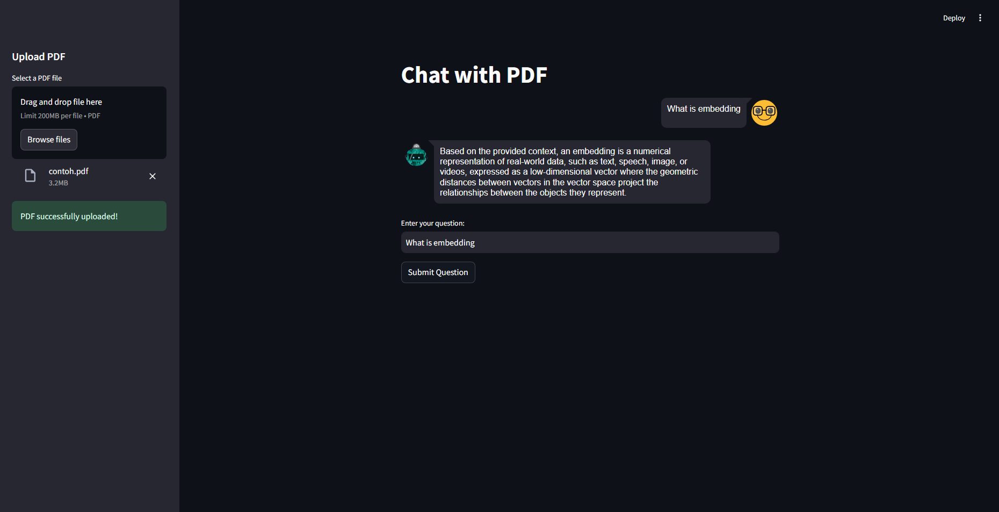

# Chatbot Streamlit with RAG (Retrieval-Augmented Generation)

This project is a chatbot built using the **Retrieval-Augmented Generation (RAG)** approach, which allows the model to augment its responses by retrieving relevant information from external knowledge sources. The chatbot interface is built using **Streamlit** for an interactive user experience.

## Project Overview

The key components of this project include:
1. **RAG Approach**: The chatbot utilizes the RAG approach, where it first retrieves relevant documents from a vector database and then generates answers based on the retrieved context.
2. **Streamlit Interface**: The user interacts with the chatbot through a web-based interface built using Streamlit.
3. **Document Upload**: Users can upload PDFs, which are processed and stored in the vector database to be queried later by the model.
4. **Knowledge Augmentation**: The chatbot answers questions by retrieving and incorporating external knowledge from uploaded documents, improving the quality and accuracy of its responses.

## Technologies Used
1. **Python**: For implementing the backend logic and handling data processing.
2. **Streamlit**: For creating the user interface of the chatbot.
3. **LangChain**: For integrating the RAG approach into the chatbot, allowing it to combine retrieval and generation.
4. **Groq**: The Llama 3.1 model from Groq is used for text generation, providing high-quality responses based on the input.
5. **ChromaDB**: Chroma is used as the vector database to store and retrieve document chunks based on embeddings.

## Approach
1. **PDF Upload and Processing**: Users can upload PDF files, which are split into smaller chunks and indexed into a vector database (ChromaDB). The chunks are stored with embeddings to allow efficient similarity-based retrieval.
2. **Question Answering**: When a user asks a question, the system retrieves relevant document chunks and passes them along with the query to the Llama 3.1 model to generate a response that combines both the external context and the model's internal knowledge.
3. **Interaction Flow**: The chatbot processes the user’s input, checks for available documents, retrieves context if necessary, and generates an appropriate answer.

## Features
- **PDF Upload**: Upload your documents in PDF format and allow the chatbot to retrieve relevant information from them.
- **Interactive Chat**: Ask questions and get answers based on the content of the uploaded documents.
- **Customizable**: Easily extend the chatbot’s capabilities by adding more document sources or modifying the RAG model.

## Result
- The chatbot provides highly accurate and contextually relevant answers by integrating external knowledge from uploaded PDFs with the model's own understanding.
- The use of ChromaDB as a vector store allows the chatbot to efficiently search through large documents and retrieve contextually relevant pieces of information to enhance its responses.

